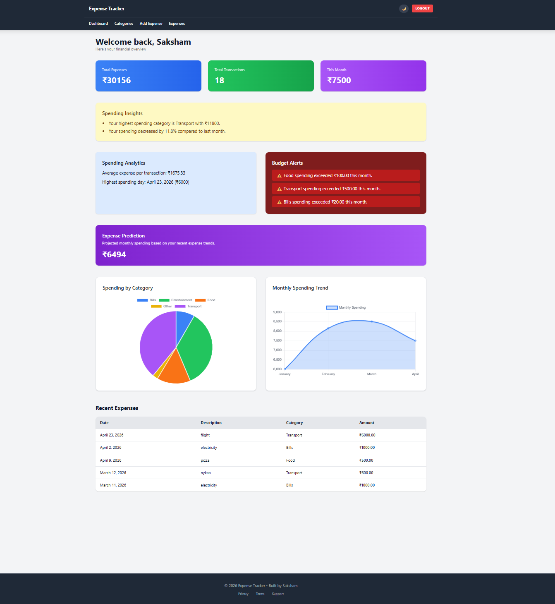
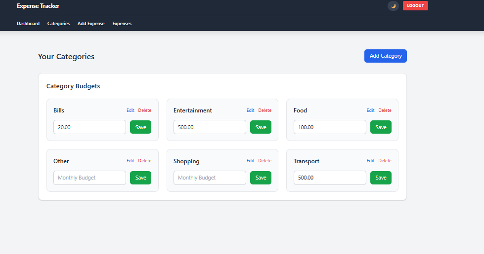
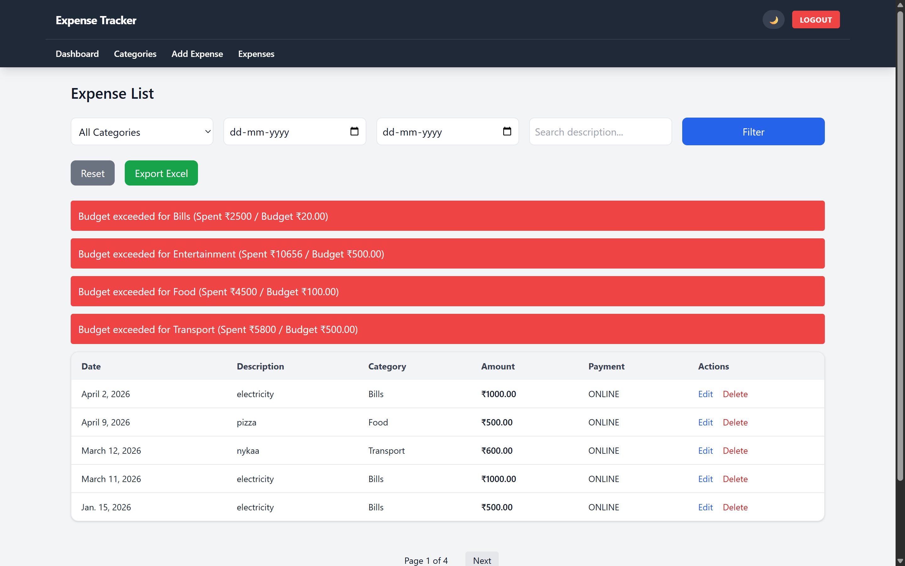

# 💰 Spending Analytics & Forecasting


A modern **AI-assisted expense tracking web application** built with **Django, Tailwind CSS, and Chart.js**. It helps users manage expenses, track spending patterns, set budgets, and get intelligent insights into their financial behavior — all in a clean, responsive interface.

---

## 🚀 Live Demo

> 🚧 Coming Soon — Deployment in progress

---

## 📸 Screenshots

### 🔐 Login Page


### 🏠 Dashboard


### ➕ Add Expense


### 📂 Categories


### 📋 Expense List


---

## ✨ Features

### 📊 Smart Dashboard
- Overview of total expenses
- Monthly spending summary
- Spending analytics at a glance
- Recent expenses table

### 🤖 AI Expense Categorization
- Predicts category automatically based on description
- Machine learning model trained from past expenses
- Suggests category before saving — saves time

### 📈 Expense Prediction
- Predicts next month's spending based on historical data
- Helps users plan and stay within budgets

### 📉 Budget Alerts
- Set per-category budgets
- Instant alerts when spending exceeds limits

### 📊 Interactive Charts
- Spending by category (Pie chart)
- Monthly spending trend (Line chart)
- Powered by Chart.js

### 🌓 Dark / Light Mode
- One-click theme toggle
- Theme preference saved via local storage

### 📱 Mobile Responsive
- Works seamlessly on phones and tablets
- Responsive navigation and layout

### ⚡ Modern UI
- Tailwind CSS styling
- Animated components
- Toast notifications
- Page loader

---

## 🛠️ Tech Stack

### Frontend
| Technology | Purpose |
|---|---|
| HTML5 | Page structure |
| Tailwind CSS | Styling & responsive layout |
| JavaScript (Vanilla) | UI interactions & theme toggle |
| Chart.js | Interactive data visualizations |

### Backend
| Technology | Purpose |
|---|---|
| Python 3 | Core language |
| Django | Web framework (MVT architecture) |
| Django Auth | User authentication & sessions |
| Gunicorn | Production WSGI server |

### Machine Learning
| Technology | Purpose |
|---|---|
| Scikit-learn | ML model training & inference |
| TF-IDF Vectorizer | Text feature extraction (NLP) |
| Multinomial Naive Bayes | Expense category classification |

### Database
| Technology | Purpose |
|---|---|
| SQLite | Development database |
| PostgreSQL | Recommended for production |

---

## 🤖 AI Category Prediction

The app includes a machine learning model that learns from your past expenses to auto-suggest categories.

**How it works:**
1. User types an expense description (e.g., "Swiggy order")
2. TF-IDF converts the text into numerical features
3. Naive Bayes classifier predicts the most likely category
4. Category is pre-filled before the user saves

**Example predictions:**

| Description | Predicted Category |
|---|---|
| Uber ride | 🚗 Transport |
| Swiggy order | 🍕 Food |
| Amazon purchase | 🎮 Entertainment |
| Electricity bill | 💡 Bills |
| Gym membership | 💪 Health |

---

## 📂 Project Structure

```
expense_tracker/
│
├── ai_engine/             # ML model & AI prediction logic
├── analytics/             # Spending analytics & reporting
├── config/                # Django project settings
├── expenses/              # Core expense CRUD app
│   ├── models.py
│   ├── views.py
│   ├── forms.py
│   └── urls.py
├── users/                 # User auth & profiles
├── templates/             # HTML templates
│   ├── base.html
│   ├── dashboard.html
│   ├── add_expense.html
│   └── expense_list.html
├── static/                # Static assets (CSS, JS, images)
├── screenshots/           # App screenshots
├── manage.py
├── requirements.txt
└── Procfile               # Deployment config (Render/Railway)
```

---

## ⚙️ Installation & Setup

### 1. Clone the repository
```bash
git clone https://github.com/Saksham3124/Expense_tracker.git
cd Expense_tracker
```

### 2. Create a virtual environment
```bash
python -m venv venv
```

### 3. Activate the environment

**Windows:**
```bash
venv\Scripts\activate
```

**Mac/Linux:**
```bash
source venv/bin/activate
```

### 4. Install dependencies
```bash
pip install -r requirements.txt
```

### 5. Run migrations
```bash
python manage.py migrate
```

### 6. Create a superuser (admin)
```bash
python manage.py createsuperuser
```

### 7. Start the development server
```bash
python manage.py runserver
```

### 8. Open in browser
```
http://127.0.0.1:8000
```

---

## 🌍 Deployment

The project is configured for easy deployment on:

- **Render**
- **Railway**
- **DigitalOcean**
- **AWS**

Production server:
```bash
gunicorn config.wsgi
```

> **Note:** Switch to PostgreSQL in production. Update `DATABASES` in `settings.py` and set environment variables accordingly.

---

## 🔐 Security

- CSRF protection (Django built-in)
- Session-based authentication
- Budget & form validation
- User-level data isolation

---

## 📌 Roadmap / Future Improvements

- [ ] Expense receipt scanning (OCR)
- [ ] AI financial recommendations
- [ ] Multi-user / family budgeting
- [ ] Export reports (PDF / Excel)
- [ ] REST API (Django REST Framework)
- [ ] Mobile app version

---

## 👨‍💻 Author

**Saksham**
B.Tech Student — BIT Mesra

[](https://github.com/Saksham3124)

---

## ⭐ Support

If you found this project useful, consider giving it a **star** on GitHub — it means a lot! ⭐
